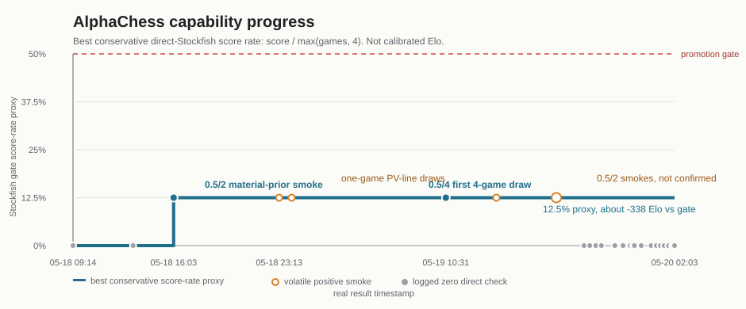

# AlphaChess

AlphaChess is a chess-native reproduction of the core AutoGo idea: use cheap game simulation, Monte Carlo Tree Search, and a policy/value network to automate the improvement loop.

The repo starts with a complete AlphaZero-style baseline:

- `python-chess` legal move generation and terminal adjudication.
- 64 x 73 AlphaZero chess action encoding with side-to-move orientation.
- Residual policy/value network in PyTorch.
- PUCT MCTS with root Dirichlet exploration for self-play.
- NPZ replay data, supervised policy/value training, and checkpointed evaluation.
- `gpu-dev submit` helper for running the loop on reserved GPUs.

This is not yet a superhuman model. It is the training and evaluation scaffold needed to iterate toward one.

## Progress Tracker

Last updated: `2026-05-20T06:02:44-07:00`.

This repo does not yet have a calibrated Elo. The direct Stockfish gates are
small, usually 2-4 games, so a formal Elo would be misleading. The table below
uses the closest honest equivalent:

- **Parent/internal score**: candidate score against the previous checkpoint or
  a weaker smoke opponent.
- **Direct Stockfish score**: score against local Stockfish at
  `engine_time=0.05`, usually with 16 MCTS simulations and
  `material_value_weight=0.15`.
- **Elo proxy**: `400 * log10(score_rate / (1 - score_rate))` against that
  exact Stockfish gate. It is only a local gate proxy, not calibrated chess Elo.



The graph is the compact AlphaGo-style view of the table: a single capability
line over real timestamps. For each direct Stockfish check, it uses
`score / max(games, 4)`, then plots the best value seen so far. That keeps
short draws visible without letting tiny samples look like 50% strength.
The current best proxy is `12.5%`, about `-338` Elo against this local gate.

Timestamps are real `git log --date=iso-strict` commit times unless marked as a
PGN file mtime or report timestamp, where the result was generated after the
latest committed report.

| Timestamp | Milestone | Parent/internal score | Direct Stockfish score | Strength read |
| --- | --- | ---: | ---: | --- |
| `2026-05-18T08:15:09-07:00` | Baseline AlphaZero pipeline bootstrapped (`e5eb2d8`). | N/A | N/A | Infrastructure only. |
| `2026-05-18T09:14:04-07:00` | Lichess 10k expert bootstrap report (`45af7b1`, `reports/2026-05-18_expert_lichess_10k.md`). | `3.0/4` vs uniform | `0.0/2` | Stockfish path working; model clearly weak. |
| `2026-05-18T13:18:35-07:00` | Focused Stockfish MultiPV 4096 training (`0baf312`, `reports/2026-05-18_legal_multipv4096_focus.md`). | `4.0/4` vs uniform | `0.0/2`, plus `0.0/1` at higher search | Better teacher accuracy, no direct strength. |
| `2026-05-18T14:35:58-07:00` | Low-LR replay iteration promoted internally (`8fbf733`). | `3.0/4` vs base | `0.0/2` | First useful internal promotion, still loses directly. |
| `2026-05-18T16:03:41-07:00` | Material value prior (`e0114c6`, `reports/2026-05-18_material_value_prior.md`). | `4.0/4` vs uniform | `0.5/2`; 64-sim check `0.0/1` | First nonzero direct Stockfish smoke; useful but not confirmed. |
| `2026-05-18T18:22:01-07:00` | Puzzle-line qvalue branch (`4f1be9b`, `reports/2026-05-18_focus_puzzlelines20_vw025_material015.md`). | `6.0/8` vs base | `0.0/2`, plus 64/128-sim losses | Best fixed teacher diagnostics at that point. |
| `2026-05-18T19:59:39-07:00` | Qvalue and poisoned-capture replay (`a6021f9`, `reports/2026-05-18_qvalue_and_poisoned_replay.md`). | qvalue `8.0/8`; poisoned branch `6.0/8` vs qvalue | direct gates still failed | Strong internal qvalue parent established. |
| `2026-05-18T23:13:16-07:00` | PV-line qvalue branch (`d0061d4`, `reports/2026-05-18_pvlines_qvalue.md`). | `6.0/8` vs qvalue | 16-sim `0.0/2`; 64-sim `0.5/1` then `0.0/2`; 128-sim `0.0/2` | Occasional higher-search draw, not stable across seeds. |
| `2026-05-19T00:04:01-07:00` | Recent PV-line qvalue branch (`1af1c34`, `reports/2026-05-18_pvlines_recent_qvalue.md`). | `8.0/8` vs qvalue | 16-sim `0.0/2`; 64-sim `0.5/1` then `0.0/2` | Repeated one-game higher-search draw signal, still unstable. |
| `2026-05-19T01:27:25-07:00` | Stockfish promotion gate documented (`d78efe0`). | N/A | gate added before promotion | Process improvement: candidates must survive direct play. |
| `2026-05-19T03:39:01-07:00` | Tree-reuse self-play PV-recent probe (`7b019cf`). | `6.0/8` vs parent | `0.0/2` | Internal wins did not transfer to Stockfish. |
| `2026-05-19T10:31:47-07:00` | Policy-head-only broad replay (`c3f1fd7`, `reports/2026-05-19_policy_head_only_broad.md`). | `8.0/16`, all draws vs qvalue | `0.5/4` | First 4-game direct Stockfish draw; tiny-sample Elo proxy about `-338` vs this gate. |
| `2026-05-19T12:11:13-07:00` | Hard-label policy-head run (`4e02a7f`, `reports/2026-05-19_policy_head_only_hardlabels.md`). | `6.0/8` vs qvalue | `0.0/4` | Better hard-label diagnostics, no direct score. |
| `2026-05-19T12:27:41-07:00` | Value-head-only calibration (`0c64101`, `reports/2026-05-19_value_head_only_hardlabels.md`). | `6.0/8` vs hard-label parent | `0.0/4` | Value fit improved, direct tactical failures remained. |
| `2026-05-19T12:40:49-07:00` | Leaf-material MCTS value blend (`7ba3097`, `reports/2026-05-19_leaf_material_mcts_probe.md`). | N/A | all tested variants `0.0/2`; broad 64-sim check `0.0/2` | Search-time material fallback did not recover the gate. |
| `2026-05-19T12:52:53-07:00` | Latest-loss replay repair (`8689a40`, `reports/2026-05-19_leaf_loss_replay_repair.md`). | `2.0/8` vs hard-label parent | `0.0/2` | Narrow loss replay overfit/regressed. |
| `2026-05-19T12:53:53-07:00` PGN file mtime | Root-mate-depth-5 inference checks (`reports/2026-05-19_rootmate5_and_16k_refresh.md`). | N/A | hard-label `0.0/2`; broad `0.0/2` | Deeper root mate filter alone was not enough. |
| `2026-05-19T13:02:42-07:00` PGN file mtime | 16k Stockfish plus latest-loss policy refresh (`reports/2026-05-19_rootmate5_and_16k_refresh.md`). | `2.0/8` vs qvalue | `0.0/2` | Broader supervised refresh also regressed. |
| `2026-05-19T13:17:29-07:00` PGN file mtime | Full-network hard-label 16k/latest-loss refresh (`reports/2026-05-19_fullhard_16k_leafloss.md`). | `2.0/8` vs qvalue | `0.0/2` | Full-network low-LR tuning also regressed. |
| `2026-05-19T13:26:47-07:00` | Root king-safety MCTS filter (`cef62fb`, `reports/2026-05-19_root_king_safety_filter.md`). | N/A | all tested variants `0.0/2` | Shallow static king-safety pruning did not recover the gate. |
| `2026-05-19T13:29:14-07:00` PGN file mtime | Policy-head broad 256-simulation follow-up (`reports/policyhead_broad_qvalue_stockfish_256sims.pgn`). | N/A | `0.0/2` | Deeper search did not reproduce the earlier Stockfish draw. |
| `2026-05-19T13:33:22-07:00` report timestamp | Policy top-k validation diagnostics (`reports/2026-05-19_policy_topk_diagnostics.md`). | N/A | N/A | Loss positions have target in top-5 about 68% of the time, so failures are partly ranking/search calibration. |
| `2026-05-19T13:36:12-07:00` report timestamp | Higher-exploration policy probe (`reports/2026-05-19_policy_exploration_probe.md`). | N/A | all tested variants `0.0/2` | Softer priors and larger `c_puct` did not recover direct play. |
| `2026-05-19T13:37:44-07:00` report timestamp | Policy-only direct probe (`reports/2026-05-19_policy_only_probe.md`). | N/A | both tested variants `0.0/2` | Search is not merely overriding a safe policy; policy-only play still blunders. |
| `2026-05-19T13:57:45-07:00` report timestamp | Hard-negative policy repair (`reports/2026-05-19_hard_negative_repair.md`). | `2.0/8` vs policy-head 16k parent | first smoke `0.5/2`; confirmation `0.0/4` | Mined top-wrong moves reduced bad-action loss but hurt top-k and did not confirm direct strength. |
| `2026-05-19T14:10:09-07:00` report timestamp | Lower-pressure hard-negative repair (`reports/2026-05-19_hard_negative_repair.md`). | `6.0/8` vs policy-head 16k parent | `0.0/2` | Lower margin pressure preserved parent strength but still failed the direct gate. |
| `2026-05-19T14:26:11-07:00` report timestamp | Mixed hard-negative repair (`reports/2026-05-19_hard_negative_repair.md`). | `8.0/8` vs policy-head 16k parent | gate `0.0/2`; confirmation `0.0/4` | Mixing broad labels preserved top-k better and dominated the parent, but still failed direct Stockfish. |
| `2026-05-19T14:30:59-07:00` report timestamp | Mixed hard-negative root-filter checks (`reports/2026-05-19_hard_negative_repair.md`). | N/A | root-material and root-king variants `0.0/2` | Existing tactical filters did not rescue the internally strong mixed checkpoint. |
| `2026-05-19T14:37:25-07:00` report timestamp | King-shelter safety filter (`reports/2026-05-19_king_shelter_filter.md`). | N/A | tested variants `0.0/2` | Pawn-shelter heuristic catches one failure pattern but still did not recover direct play. |
| `2026-05-19T14:51:35-07:00` report timestamp | Soft broad-policy hard-negative mix (`reports/2026-05-19_hard_negative_repair.md`). | `6.0/8` vs policy-head 16k parent | `0.0/2` | Keeping broad MultiPV labels soft did not materially improve hard-target top-k or direct play. |
| `2026-05-19T15:34:00-07:00` report timestamp | Direct loss-blunder replay repairs (`reports/2026-05-19_hard_negative_repair.md`). | balanced repair `4.0/8`; direct-loss mix `8.0/8` vs soft-mix parent | both `0.0/2` | A 100-position direct-loss replay improved top-3/top-5 and bad-action loss slightly, but target top-1 stayed `0.12` and direct play still failed. |
| `2026-05-19T15:48:50-07:00` report timestamp | Full-network loss-blunder repair (`reports/2026-05-19_hard_negative_repair.md`). | `4.0/8` vs direct-loss mix parent | `0.0/2` | Unfreezing the trunk reduced targeted bad-action loss and nudged target top-1 to `0.13`, but broad teacher accuracy regressed and direct play still failed. |
| `2026-05-19T16:00:27-07:00` report timestamp | Root material worst-depth guard (`reports/2026-05-19_hard_negative_repair.md`). | N/A | guarded variants all `0.0/2` | Fixed a non-monotonic material-pruning issue, but the combined root guards still did not recover direct play. |
| `2026-05-19T16:49:45-07:00` report timestamp | Broader all-loss bad-action replay from direct-mix parent (`reports/2026-05-19_hard_negative_repair.md`). | `4.0/8`, all draws vs direct-loss mix parent | `0.0/2` | Broader bad-action data preserved broad teacher accuracy and improved top-3/margin diagnostics slightly, but top-1 and direct play did not improve. |
| `2026-05-19T17:07:29-07:00` report timestamp | Broad32k Stockfish scale probe (`reports/2026-05-19_broad32k_scale_probe.md`). | `0.0/8` vs direct-loss mix parent | `0.0/2` | A 32k broad MultiPV teacher set exposed weak generalization; naive policy-head fine-tuning regressed validation and play. |
| `2026-05-19T17:18:35-07:00` report timestamp | Broad32k epoch-1 follow-up (`reports/2026-05-19_broad32k_scale_probe.md`). | `6.0/8` vs direct-loss mix parent | `0.0/2` | The first epoch improved broad32k validation and parent play before epoch 2 collapsed, but direct Stockfish still failed. |
| `2026-05-19T17:39:49-07:00` report timestamp | Validation-selected broad32k follow-up (`e4e3199`, `reports/2026-05-19_broad32k_scale_probe.md`). | `4.0/8` vs direct-loss mix parent | `0.0/2` | `--select-best-by val_source_0_policy_acc` kept epoch 1 as `latest.pt`, avoiding final-epoch collapse, but direct Stockfish still failed. |
| `2026-05-19T18:01:50-07:00` report timestamp | Select-loss targeted broad32k repair (`reports/2026-05-19_broad32k_scale_probe.md`). | `2.0/8` vs selected broad32k parent | first smoke `0.5/2`; confirmation `0.0/4` | New selected-loss replay raised broad32k top-1 to `0.3596` and found one draw, but it regressed parent play and did not confirm direct strength. |
| `2026-05-19T18:14:27-07:00` report timestamp | Full-network selected-loss repair (`reports/2026-05-19_broad32k_scale_probe.md`). | `2.0/8` vs selected broad32k parent | `0.0/2` | Unfreezing the trunk reduced targeted bad-action loss but regressed broad32k top-1 to `0.3383` and still failed direct Stockfish. |
| `2026-05-19T18:48:42-07:00` report timestamp | Broad32k hard-label selector repair (`reports/2026-05-19_broad32k_scale_probe.md`, `reports/policyhead_broad32k_hardlabels_selectbest_stockfish_gate.pgn`). | `6.0/8` vs selected broad32k parent | `0.0/2` | Hard-label fine-tuning selected epoch 3 and lifted broad32k source-0 top-1 to `0.3605`, but direct Stockfish still failed. |
| `2026-05-19T19:11:04-07:00` report timestamp | Hard-label loss-repair probe (`reports/2026-05-19_broad32k_scale_probe.md`). | `8.0/8` vs hard-label parent | gate `0.0/2`; material `0.0/2`; root guards `0.0/2` | New loss replay raised broad32k hard-label top-1 to `0.3661`, but the direct tactical failures persisted. |
| `2026-05-19T19:34:49-07:00` report timestamp | Broad65k scale probe (`reports/2026-05-19_broad65k_scale_probe.md`). | `4.0/8` vs hard-label loss-repair parent | `0.0/2` | Doubling the broad teacher to 65k nudged validation but regressed parent play and did not move direct Stockfish. |
| `2026-05-19T19:56:50-07:00` report timestamp | Broad65k expert-mix follow-up (`reports/2026-05-19_broad65k_scale_probe.md`). | `4.0/8` vs hard-label loss-repair parent | `0.0/2` | Mixing expert rapid games improved expert-move validation but regressed broad Stockfish validation and still failed direct play. |
| `2026-05-19T20:27:24-07:00` report timestamp | Fullnet192 capacity scratch probe (`reports/2026-05-19_fullnet192_capacity_probe.md`). | `8.0/8` vs uniform | gate `0.0/2`; 64-sim `0.0/2`; policy-only `0.0/2` | A larger 192x8 model memorized broad/loss labels far better, but direct tactical play still failed. |
| `2026-05-19T20:49:36-07:00` report timestamp | Fullnet192 puzzle-mix follow-up (`reports/2026-05-19_fullnet192_capacity_probe.md`). | `2.0/8` vs fullnet192 scratch parent | `0.0/2` | Puzzle-line fine-tuning improved puzzle validation only modestly and regressed parent play. |
| `2026-05-19T21:18:15-07:00` report timestamp | Fullnet192 loss-blunder replay data (`reports/2026-05-19_fullnet192_capacity_probe.md`). | N/A | N/A | Mined `238` positions and `34` bad-action labels from fullnet192 direct losses; GPU repair was blocked by reservation snapshot prep. |
| `2026-05-19T21:22:07-07:00` report timestamp | CPU fullnet192 loss-overfit smoke (`reports/2026-05-19_fullnet192_capacity_probe.md`). | N/A | `0.0/2` | Narrow CPU policy-head overfit worsened full-slice bad-action loss to `4.4458` vs parent `4.4038`, so it was rejected. |
| `2026-05-19T21:33:15-07:00` report timestamp | Disjoint Stockfish holdout probe (`reports/2026-05-19_stockfish_holdout_probe.md`). | N/A | N/A | New skipped-position 8,192-position holdout shows fullnet192 puzzle-mix has best unseen top-1 so far (`0.3429`), while 128x6 expert mix keeps better top-5 (`0.6803`). |
| `2026-05-19T21:51:50-07:00` report timestamp | Fullnet192 holdout-selected repair (`reports/2026-05-19_stockfish_holdout_probe.md`). | `2.0/4` vs fullnet192 puzzle-mix parent | `0.0/2` | Holdout-selected policy-head tuning nudged unseen top-1 to `0.3439` and reduced fullnet192 loss-slice bad-action loss to `3.1139`, but direct play still failed. |
| `2026-05-19T22:01:55-07:00` report timestamp | Latest-loss replay follow-up (`reports/2026-05-19_stockfish_holdout_probe.md`). | N/A | `0.0/2` | New 49-position loss replay reduced targeted bad-action losses, but broad holdout top-1 regressed to `0.3416` and direct play still failed. |
| `2026-05-19T22:07:00-07:00` PGN file mtime | Strict root-guard check (`reports/2026-05-19_t05_teacher_probe.md`). | N/A | `0.0/2` | Existing root mate/material/king-safety guards still lost through deeper attacking sequences. |
| `2026-05-19T22:33:45-07:00` report timestamp | Higher-time Stockfish teacher probe (`reports/2026-05-19_t05_teacher_probe.md`). | N/A | `0.0/2` | `0.05s` broad labels improved t05 and loss-slice metrics, but disjoint holdout top-1 regressed to `0.3420` and direct play still failed. |
| `2026-05-19T23:13:05-07:00` PGN file mtime | Broad/t05 top-1 hard-negative repair (`reports/2026-05-19_hard_negative_topk_repair.md`). | N/A | `0.0/2` | Mined `11,290` top-wrong broad/t05 positions and nudged disjoint holdout top-1 to `0.3442`, but direct play still failed. |
| `2026-05-19T23:33:20-07:00` PGN file mtime | Top-3 hard-negative repair (`reports/2026-05-19_hard_negative_topk_repair.md`). | N/A | `0.0/2` | New vector bad-action training reduced top-3 hard-negative loss, but disjoint holdout top-1 regressed to `0.3436` and direct play still failed. |
| `2026-05-19T23:49:30-07:00` PGN file mtime | Opening/ELO2000/tactical mix (`reports/2026-05-19_opening_elo2000_tactical_probe.md`). | N/A | `0.0/2` | Specialist opening and tactical sources improved their own split metrics but regressed broad holdout top-1 to `0.3425` and still failed direct play. |
| `2026-05-20T00:01:38-07:00` report timestamp | Soft-MultiPV recalibration (`reports/2026-05-20_softmultipv_recalibration_probe.md`). | N/A | not gated | Dense MultiPV targets regressed disjoint holdout top-1 to `0.3374`, so the branch was rejected before direct play. |
| `2026-05-20T00:22:48-07:00` PGN file mtime | Stockfish-confirmed model-blunder mining (`reports/2026-05-20_stockfish_confirmed_blunder_mining.md`). | N/A | `0.0/2` | New miner found `2,010` true value-dropping model top moves; a small policy-head repair reduced bad-action loss slightly but still failed direct play. |
| `2026-05-20T00:40:04-07:00` PGN file mtime | Stockfish-confirmed full-network repair (`reports/2026-05-20_stockfish_confirmed_blunder_mining.md`). | N/A | `0.0/2` | H100 trunk-unfrozen repair nudged disjoint holdout top-1 to `0.3446` and confirmed-blunder top-1 to `0.0199`, but direct play did not improve. |
| `2026-05-20T00:45:14-07:00` PGN file mtime | Bad-margin-selected full-network repair (`reports/2026-05-20_stockfish_confirmed_blunder_mining.md`). | N/A | `0.0/2` | Stronger bad-action pressure improved confirmed-blunder bad-action loss to `4.0162` and top-1 to `0.0209`, but broad holdout slipped and the gate still failed. |
| `2026-05-20T00:58:51-07:00` PGN file mtime | Broad73k confirmed-blunder full-network repair (`reports/2026-05-20_stockfish_confirmed_blunder_mining.md`). | N/A | `0.0/2` | Larger mining found `4,687` confirmed blunders and lifted that slice's top-1 to `0.0365`, but it still lost both direct games. |
| `2026-05-20T01:03:44-07:00` PGN file mtime | Exact bad-action book on hard-negative parent (`reports/2026-05-20_stockfish_confirmed_blunder_mining.md`). | N/A | `0.0/2` | Eval-time blocklist from the 4,687 confirmed blunders did not recover direct play. |
| `2026-05-20T01:04:09-07:00` PGN file mtime | Exact bad-action book on broad73k repair (`reports/2026-05-20_stockfish_confirmed_blunder_mining.md`). | N/A | `0.0/2` | Applying the same exact-position blocklist to the repaired checkpoint also lost both direct games. |
| `2026-05-20T01:07:29-07:00` PGN file mtime | Bad-action book plus strict root guards (`reports/2026-05-20_stockfish_confirmed_blunder_mining.md`). | N/A | `0.0/2` | Combining the exact-position blocklist with stricter mate/material/king-safety root filters still failed. |
| `2026-05-20T01:14:58-07:00` PGN file mtime | 64-sim bad-action book plus strict root guards (`reports/2026-05-20_stockfish_confirmed_blunder_mining.md`). | N/A | `0.0/2` | H100 64-simulation search with the same book and strict root filters also lost both games. |
| `2026-05-20T01:34:48-07:00` PGN file mtime | Top-3 broad73k confirmed-blunder repair (`reports/2026-05-20_stockfish_confirmed_blunder_mining.md`). | N/A | `0.0/2` | Top-3 mining found `8,001` positions and `16,268` bad-action labels; repair reached the best disjoint holdout top-1 so far (`0.3452`) but still failed direct play. |
| `2026-05-20T01:39:08-07:00` PGN file mtime | Top-3 bad-action book plus strict guards (`reports/2026-05-20_stockfish_confirmed_blunder_mining.md`). | N/A | `0.0/2` | Applying the top-3 blocklist with strict root filters also lost both games. |
| `2026-05-20T01:53:38-07:00` PGN file mtime | Fresh direct-loss full-network repair (`reports/2026-05-20_stockfish_confirmed_blunder_mining.md`). | N/A | `0.0/2` | A 399-position latest-loss PV slice improved direct-loss bad-action loss from `2.9992` to `2.9056`, but broad holdout top-1 slipped to `0.3440` and direct play still failed. |
| `2026-05-20T01:55:16-07:00` PGN file mtime | Fresh direct-loss full-network repair plus bad-action book and strict guards (`reports/2026-05-20_stockfish_confirmed_blunder_mining.md`). | N/A | `0.0/2` | Adding the top-3 plus latest-loss blocklists and stricter tactical root filters did not recover the gate. |
| `2026-05-20T02:00:27-07:00` PGN file mtime | Aggressive direct-loss policy-head repair (`reports/2026-05-20_stockfish_confirmed_blunder_mining.md`). | N/A | `0.0/2` | Heavier latest-loss weighting improved that slice to top-1 `0.2256`, top-3 `0.4361`, and bad-action loss `2.7075`, but broad holdout regressed to `0.3428` and direct play still failed. |
| `2026-05-20T02:03:04-07:00` PGN file mtime | Aggressive direct-loss policy-head repair plus bad-action book and strict guards (`reports/2026-05-20_stockfish_confirmed_blunder_mining.md`). | N/A | `0.0/2` | The stricter root filters and exact blocklists still lost both games, so the new replay did not transfer to direct Stockfish play. |
| `2026-05-20T02:29:22-07:00` PGN file mtime | All-history direct-loss full-network repair (`reports/2026-05-20_stockfish_confirmed_blunder_mining.md`). | N/A | `0.0/2` | Mining all tracked Stockfish PGNs produced `4,096` positions and `780` bad actions; the repair fit that historical slice to top-1 `0.2925` and bad-action loss `1.7075`, but broad holdout fell to `0.3430` and the latest-loss slice did not improve. |
| `2026-05-20T02:31:10-07:00` PGN file mtime | All-history direct-loss repair plus bad-action books and strict guards (`reports/2026-05-20_stockfish_confirmed_blunder_mining.md`). | N/A | `0.0/2` | Combining the all-history blocklist, latest-loss blocklist, top-3 blocklist, and strict root guards still failed both Stockfish games. |
| `2026-05-20T02:43:05-07:00` PGN file mtime | Recent-PGN direct-loss full-network repair (`reports/2026-05-20_stockfish_confirmed_blunder_mining.md`). | N/A | `0.0/2` | Re-mining from the 80 most recent PGN mtimes produced `4,096` positions and `772` bad actions; the repair nudged the latest-loss bad-action loss to `2.9265`, but broad holdout fell to `0.3420` and direct play still failed. |
| `2026-05-20T02:44:39-07:00` PGN file mtime | Recent-PGN direct-loss repair plus bad-action books and strict guards (`reports/2026-05-20_stockfish_confirmed_blunder_mining.md`). | N/A | `0.0/2` | Recency-biased replay plus exact blocklists and strict root filters also lost both games. |
| `2026-05-20T03:02:04-07:00` PGN file mtime | Context direct-loss full-network repair (`reports/2026-05-20_stockfish_confirmed_blunder_mining.md`). | N/A | `0.0/2` | `--blunder-context-plies 2` backfilled lead-up decisions around recent losses, producing `4,096` positions and `550` bad actions; the selected epoch kept broad holdout at `0.3420` and context top-1 at `0.2761`, but direct play still failed. |
| `2026-05-20T03:05:53-07:00` PGN file mtime | Context direct-loss repair plus bad-action books and strict guards (`reports/2026-05-20_stockfish_confirmed_blunder_mining.md`). | N/A | `0.0/2` | Context replay plus exact blocklists and strict root filters still lost both Stockfish games. |
| `2026-05-20T03:08:48-07:00` PGN file mtime | Context direct-loss full-network repair at 64 simulations (`reports/2026-05-20_stockfish_confirmed_blunder_mining.md`). | N/A | `0.0/2` | Raising search from 16 to 64 simulations did not rescue the context checkpoint. |
| `2026-05-20T03:13:57-07:00` PGN file mtime | Context direct-loss value-head-only repair (`reports/2026-05-20_stockfish_confirmed_blunder_mining.md`). | N/A | `0.0/2` | Freezing policy/trunk and recalibrating only the value head also failed the direct Stockfish gate. |
| `2026-05-20T03:24:21-07:00` PGN file mtime | First-blunder-only context policy-head repair (`reports/2026-05-20_stockfish_confirmed_blunder_mining.md`). | N/A | `0.0/2` | Mining only the first confirmed blunder per recent loss game produced `1,155` focused positions and `163` bad actions; policy-head repair fit that slice but still lost both direct games. |
| `2026-05-20T03:43:09-07:00` PGN file mtime | First-blunder plus puzzle-line full-network repair (`reports/2026-05-20_stockfish_confirmed_blunder_mining.md`). | N/A | `0.0/2` | Adding `100,000` puzzle-line positions improved puzzle validation to `0.3602`, but broad holdout fell to `0.3413`, recent-loss metrics regressed, and the direct gate still failed. |
| `2026-05-20T04:02:45-07:00` PGN file mtime | Loss-only opening-context full-network repair (`reports/2026-05-20_opening_loss_repair.md`). | N/A | plain `0.0/2`; book+strict `0.0/2` | `--player-score-max 0.0` enabled loss-only mining; wider opening context improved targeted bad-action loss but broad holdout fell to `0.3356` and direct play still failed. |
| `2026-05-20T04:21:51-07:00` PGN file mtime | Recent opening all-blunders policy-head repair (`reports/2026-05-20_opening_loss_repair.md`). | N/A | plain `0.0/2`; book+strict `0.0/2` | Mining all early confirmed blunders from the `80` most recent Stockfish PGNs produced `4,096` positions and `763` bad actions; exact books changed the openings but did not stop adjacent tactical collapses. |
| `2026-05-20T04:32:27-07:00` PGN file mtime | Recent opening all-blunders full-network repair (`reports/2026-05-20_opening_loss_repair.md`). | N/A | plain `0.0/2`; book+strict `0.0/2` | Full-network fitting reduced recent all-blunders bad-action loss to `2.0906`, but disjoint holdout fell to `0.3370` and direct play still failed. |
| `2026-05-20T04:56:40-07:00` PGN file mtime | Dense legal-bad-action opening repair (`reports/2026-05-20_opening_loss_repair.md`). | N/A | plain `0.0/2`; book+strict `0.0/2` | All-legal Stockfish sweep wrote `8,705` bad-action labels across `1,147` recent positions; policy-head repair lowered recent direct-loss bad-action loss to `2.3248`, but disjoint holdout fell to `0.3361` and direct play still failed. |
| `2026-05-20T05:15:06-07:00` PGN file mtime | Dense legal-value policy opening repair (`reports/2026-05-20_opening_loss_repair.md`). | N/A | plain `0.0/2`; book+strict `0.0/2` | Dense legal-move value policy improved its own policy loss to `5.0559` and recent direct-loss bad-action loss to `2.3648`, but broad holdout fell to `0.3356` and both direct gates still failed. |
| `2026-05-20T05:50:15-07:00` PGN file mtime | Capture-starting mate-search guard (`reports/2026-05-20_opening_loss_repair.md`). | N/A | book+strict `0.0/2` | Root mate search now follows checking moves plus high-priority captures/promotions, catching a real `...axb3` forced-mate family from the latest gate; the comparable depth-5 Stockfish check still failed. |
| `2026-05-20T06:02:44-07:00` PGN file mtime | Exact Stockfish good-action book (`reports/2026-05-20_opening_loss_repair.md`). | N/A | good+bad book strict `0.0/2` | Exact teacher best-move filtering restored the known `e4 e5 Nf3 Nc6 d4` opening line, but direct play still collapsed tactically after leaving the book. |

Current practical status:

- Best 4-game direct result so far: `0.5/4` against the local Stockfish smoke
  gate from the policy-head broad run. Earlier `0.5/2` and `0.5/1` direct
  smokes exist, but they did not confirm in follow-up checks.
- Best direct-smoke checkpoint so far is still the policy-head broad run, but
  it is not promotable. The strongest current supervised holdout checkpoint is
  the top-3 confirmed-blunder full-network repair (`0.3452` disjoint holdout
  top-1), with latest direct-loss replay follow-ups regressing that holdout and
  still failing direct play.
- Latest diagnostics show both ranking and policy-confidence failures: many
  loss positions have the Stockfish target in the policy top-5, while recent
  direct losses also include high-confidence policy top-1 blunders. A focused
  direct-loss replay improved top-3/top-5 and bad-action loss slightly, but did
  not move target top-1 or the direct Stockfish gate.
- Policy-only direct play also loses tactically, so the policy head still needs
  stronger direct-play reliability before MCTS can amplify it.
- Hard-negative mining can produce direct draws, but the first weight tried
  over-penalized wrong top moves and regressed the parent match; lower pressure
  preserved parent strength but still failed direct Stockfish.
- Mixing hard negatives with broad labels can dominate the internal parent, but
  that internal gain still does not transfer to the direct Stockfish gate.
- The optional king-shelter filter catches a recurring pawn-shield blunder
  pattern, but direct losses remain broader than that heuristic.
- The root mate guard now catches forced mates that start with non-checking
  captures or promotions. A real depth-7 gate FEN is fixed, but the practical
  depth-5 Stockfish check still loses both games.
- Exact Stockfish good-action books can now override heuristic root guards at
  known teacher positions, but the first direct gate with the legal-value book
  still lost both games after the opening line.
- Softening the broad Stockfish source did not fix the gap between internal
  parent wins and direct Stockfish play.
- Direct-loss blunder replay can also dominate the internal parent, but the
  high-confidence blunders need a stronger signal than a small policy-head-only
  fine-tune.
- Low-LR full-network fine-tuning moved the targeted margin loss more than
  policy-head-only tuning, but it regressed broad teacher accuracy and still
  failed Stockfish.
- The root material filter is now more conservative across search depths, but
  guarded direct checks still fail, so the current blocker is broader than one
  tactical root-pruning horizon issue.
- Broader all-loss bad-action replay preserves broad teacher accuracy better
  than the small direct-loss slice, but it still does not move direct-loss
  top-1 or the direct Stockfish gate.
- A broader 32k Stockfish teacher diagnostic now exists. The direct-loss mix
  parent is best on it so far; validation-selected fine-tuning now keeps the
  better first epoch instead of the collapsed final epoch, but the selected
  checkpoint still failed direct Stockfish.
- Targeted replay from the selected broad32k losses can produce another small
  direct draw and the best broad32k fixed top-1 so far, but its 4-game
  confirmation failed and the parent match regressed.
- Full-network selected-loss repair reduced targeted bad-action loss but
  regressed broad32k policy accuracy and still failed direct Stockfish.
- Hard-label broad32k fine-tuning produced the best broad32k source-0 top-1
  so far and beat the selected broad32k parent internally, but direct Stockfish
  remained `0.0/2`.
- A follow-up hard-label loss repair lifted broad32k hard-label top-1 to
  `0.3661` and beat its parent `8.0/8`, but material blending and root guards
  still scored `0.0/2` each against Stockfish.
- Doubling the broad teacher set to 65k positions only nudged fixed validation
  (`0.3488` top-1 on 65k, `0.3665` on the older 32k slice) and regressed the
  parent match to `4.0/8`; broader cheap labels alone are not enough.
- Adding rapid expert games lifted expert top-1 to `0.4171`, but broad65k
  top-1 fell to `0.3476`, the parent match stayed `4.0/8`, and direct Stockfish
  remained `0.0/2`.
- A larger 192x8 full-network scratch model can memorize the broad65k teacher
  (`0.8620` top-1) and the tiny loss slice (`0.9091` top-1), but policy-only,
  16-sim, and 64-sim direct checks all still lost.
- Puzzle-line fine-tuning of that larger model improved puzzle validation only
  to `0.3442` on its split and lost the parent match `2.0/8`, so the current
  puzzle mix is not sufficient either.
- Fullnet192 loss-blunder replay now exists with `238` positions and `34`
  bad-action labels, but the first CPU-only overfit smoke worsened the targeted
  loss slice and still scored `0.0/2` against Stockfish.
- A disjoint 8,192-position broad Stockfish holdout now exists. It shows the
  fullnet192 puzzle-mix branch has the best unseen top-1 so far (`0.3429`), but
  the 128x6 broad65k expert mix still has better top-5 (`0.6803`).
- Holdout-selected policy-head tuning of the fullnet192 branch improves that
  holdout top-1 only slightly (`0.3439`) and still fails direct Stockfish.
- Replaying the latest fullnet192 direct losses improves targeted bad-action
  losses but regresses broad holdout top-1, so the current failure is not fixed
  by another narrow loss-slice policy-head repair.
- Existing strict root guards and higher-time broad Stockfish labels both fail
  to move the direct gate so far; deeper attacking collapses remain the current
  blocker.
- Broader model-mined hard negatives can still improve supervised holdout
  metrics slightly, and the holdout-selected full-network confirmed-blunder
  follow-up nudged the best disjoint broad holdout top-1 to `0.3446`. That
  still did not transfer to direct Stockfish play.
- Adding specialist opening, ELO2000, and tactical continuation slices improves
  those local source metrics but regresses the broad holdout and still fails the
  direct gate.
- Dense MultiPV soft-target recalibration regressed the hard-label holdout
  ranking badly (`0.3374` top-1), so it is not a useful repair for the current
  checkpoint.
- Stockfish-confirmed model-blunder mining found a sharper signal than plain
  label disagreement, but the first small policy-head repair still left target
  top-1 at `0.0` on that mined slice and scored `0.0/2` against Stockfish.
- Full-network H100 follow-ups on the same confirmed-blunder slice got mined
  target top-1 off zero, but only to about `2%`; a broader 73k mining pass
  raised the larger slice to `3.65%` top-1, and top-3 confirmed-blunder mining
  pushed disjoint holdout top-1 to `0.3452`. All variants still scored `0.0/2`
  against Stockfish.
- Exact-position bad-action filtering is now available at eval time, but the
  first broad73k blocklist checks still scored `0.0/2`; the current direct
  losses are not fixed by suppressing known mined FEN/action pairs, even with
  stricter root tactical filters and 64-simulation search layered on top.
- A fresh direct-loss PV slice from the newest six failed Stockfish games
  produced `399` positions and `57` Stockfish-confirmed bad played actions.
  Full-network and aggressive policy-head repairs improved that narrow slice,
  but both plain and bad-action-book-plus-strict gates remained `0.0/2`.
- Expanding direct-loss mining to all tracked Stockfish PGNs produced `4,096`
  positions and `780` bad played actions. It fit the historical slice much
  better, but did not help the latest-loss slice or the direct Stockfish gate.
- Repeating that mining with the 80 most recent PGN mtimes produced another
  `4,096`-position slice and moved the latest-loss bad-action loss only
  slightly; direct gates still stayed `0.0/2`.
- Adding lead-up context positions around recent direct-loss blunders improved
  the new context slice fit, but did not move either plain or strict direct
  Stockfish gates.
- A 64-simulation gate on that context checkpoint also stayed `0.0/2`, so this
  failure is not just the 16-simulation gate being too shallow.
- A value-head-only recalibration on the same broad/context labels also stayed
  `0.0/2`, so the latest tactical failures are not fixed by a small value-head
  patch alone.
- First-blunder-only mining reduces downstream forced-loss noise and fits
  cleanly, but a narrow policy-head repair from it still failed direct play.
- Adding broad puzzle-line tactics to that first-blunder objective improved
  puzzle fit but did not transfer to direct Stockfish play.
- Loss-only opening mining and exact bad-action books changed some failed
  opening choices, but the model still collapses in adjacent tactical lines.
- Full-network all-blunders tuning reduced the targeted recent-opening
  bad-action loss slightly, but broad holdout regressed and both plain and
  strict direct gates remained `0.0/2`.
- Dense legal bad-action mining now labels many bad alternatives per opening
  position, not just the played blunder. It improves local bad-action losses,
  but the latest policy-head repair still lost both plain and strict Stockfish
  gates.
- Dense legal-value policy targets also improve their own replay metrics, but
  the latest policy-head-only run still regressed the broad holdout and failed
  direct play.
- No checkpoint has passed the direct Stockfish promotion gate. This is not a
  superhuman model yet.

## Setup

```bash
uv sync
uv run pytest
```

## CPU Smoke Loop

```bash
uv run alpha-chess self-play --games 2 --simulations 8 --out data/selfplay/smoke
uv run alpha-chess train --data data/selfplay/smoke --out checkpoints/smoke --epochs 1 --batch-size 8
uv run alpha-chess eval --checkpoint checkpoints/smoke/latest.pt --games 2 --simulations 8
```

When a UCI engine is installed, evaluate directly against it:

```bash
uv run alpha-chess eval --checkpoint checkpoints/run/latest.pt --opponent stockfish --engine-path stockfish --engine-time 0.05
```

Install a local ignored Stockfish binary:

```bash
scripts/install_stockfish.sh
uv run alpha-chess eval --checkpoint checkpoints/run/latest.pt --opponent stockfish --engine-path tools/stockfish/bin/stockfish --engine-time 0.05
uv run alpha-chess eval --checkpoint checkpoints/run/latest.pt --opponent stockfish --engine-path tools/stockfish/bin/stockfish --pgn-out reports/eval_games.pgn
```

Serve a checkpoint as a UCI engine:

```bash
uv run alpha-chess uci --checkpoint checkpoints/run/latest.pt --simulations 128
```

## Expert Bootstrap

Convert PGN games into sparse expert action/value targets:

```bash
uv run alpha-chess import-pgn --pgn games.pgn --out data/expert --max-games 10000
uv run alpha-chess import-pgn --pgn lichess_elite.pgn.zst --out data/expert/elite --max-games 100000
uv run alpha-chess import-pgn --pgn lichess_elite.pgn.zst --out data/expert/elite_2200 --min-elo 2200 --max-imported-games 10000
uv run alpha-chess import-pgn --pgn lichess_elite.pgn.zst --out data/expert/elite_rapid --min-elo 2000 --min-initial-seconds 180
uv run alpha-chess train --data data/expert --out checkpoints/expert --epochs 4
uv run alpha-chess train --data data/expert/elite data/teacher/tactics --out checkpoints/mixed --epochs 2
uv run alpha-chess train --data data/expert/elite data/teacher/tactics data/puzzles/mate --data-weights 0.7 0.2 0.1 --out checkpoints/mixed
uv run alpha-chess train --data data/expert/elite --out checkpoints/expert_legal --legal-policy-loss
uv run alpha-chess validate --checkpoint checkpoints/mixed/latest.pt --data data/expert/elite data/teacher/tactics data/puzzles/mate --legal-policy-loss
```

GPU pretraining from an imported expert dataset:

```bash
DATA_DIR=data/expert/lichess_2013_01_10k OUT_DIR=checkpoints/expert_10k scripts/submit_gpu_expert_train.sh
CHECKPOINT=checkpoints/expert_10k/latest.pt OUT_DIR=checkpoints/expert_10k_e2 scripts/submit_gpu_expert_train.sh
DATA_DIR="data/expert/elite data/teacher/tactics data/puzzles/mate" DATA_WEIGHTS="0.7 0.2 0.1" OUT_DIR=checkpoints/mixed scripts/submit_gpu_expert_train.sh
DATA_DIR=data/expert/elite LEGAL_POLICY_LOSS=1 OUT_DIR=checkpoints/expert_legal scripts/submit_gpu_expert_train.sh
```

Generate Stockfish teacher labels from selected PGN positions:

```bash
uv run alpha-chess stockfish-teacher \
  --pgn games.pgn.zst \
  --out data/teacher/stockfish_sample \
  --engine-path tools/stockfish/bin/stockfish \
  --max-positions 1024 \
  --min-elo 1800 \
  --min-initial-seconds 180 \
  --min-value-delta 0.25 \
  --multipv 4 \
  --policy-temperature-cp 200

uv run alpha-chess stockfish-teacher \
  --pgn games.pgn.zst \
  --out data/teacher/stockfish_holdout \
  --engine-path tools/stockfish/bin/stockfish \
  --skip-positions 65536 \
  --max-positions 8192 \
  --min-elo 1800 \
  --min-initial-seconds 180 \
  --multipv 4 \
  --policy-temperature-cp 200

uv run alpha-chess stockfish-teacher \
  --pgn reports/failed_eval_games_a.pgn reports/failed_eval_games_b.pgn \
  --out data/teacher/alpha_loss_blunders \
  --engine-path tools/stockfish/bin/stockfish \
  --player-name AlphaChess \
  --position-stride 1 \
  --min-value-delta 0.20
```

For loss-PGN repair data, include Stockfish PV continuations and the actual
game-line states Alpha entered after the sampled mistake:

```bash
uv run alpha-chess stockfish-teacher \
  --pgn reports/failed_eval_games_a.pgn reports/failed_eval_games_b.pgn \
  --out data/teacher/alpha_loss_lines \
  --engine-path tools/stockfish/bin/stockfish \
  --player-name AlphaChess \
  --position-stride 1 \
  --min-value-delta 0.08 \
  --multipv 4 \
  --policy-temperature-cp 200 \
  --blunder-context-plies 2 \
  --first-blunder-only \
  --pv-plies 4 \
  --game-line-plies 2
```

When `stockfish-teacher` is run with `--min-value-delta`, it also stores the
played PGN move as `bad_actions` when that move differs from Stockfish's target
move. Add `--blunder-context-plies` to also label a few earlier sampled
positions from the same game whenever a confirmed blunder is found; this gives
loss-PGN repair runs direct supervision on the lead-up decisions before a
forcing tactic. Add `--first-blunder-only` when mining failed games to focus
the replay on the first confirmed mistake instead of later forced-loss
positions. Training can use those negative labels with a margin loss:

```bash
uv run alpha-chess train \
  --checkpoint checkpoints/current/latest.pt \
  --data data/teacher/stockfish_sample data/teacher/alpha_loss_blunders \
  --holdout-data data/teacher/stockfish_holdout \
  --data-weights 0.8 0.2 \
  --legal-policy-loss \
  --bad-action-weight 0.25 \
  --bad-action-margin 1.0 \
  --select-best-by holdout_policy_acc \
  --out checkpoints/bad_action_repair
```

When a run spans multiple epochs, keep the best validation epoch as `latest.pt`
instead of blindly using the final epoch. Use `--holdout-data` with a
`holdout_*` selector when you have a disjoint validation set:

```bash
uv run alpha-chess train \
  --checkpoint checkpoints/current/latest.pt \
  --data data/teacher/stockfish_sample \
  --holdout-data data/teacher/stockfish_holdout \
  --legal-policy-loss \
  --select-best-by holdout_policy_acc \
  --out checkpoints/selected_best
```

To repair policy ranking directly, mine the checkpoint's current top legal
wrong move on Stockfish-labeled replay and use that as `bad_actions`:

```bash
uv run alpha-chess hard-negatives \
  --checkpoint checkpoints/current/latest.pt \
  --data data/teacher/stockfish_sample \
  --out data/teacher/current_hard_negatives \
  --prefer-action-labels
```

To focus on model moves that Stockfish confirms are harmful, mine only top
model moves whose played continuation drops the root value:

```bash
uv run alpha-chess model-blunders \
  --checkpoint checkpoints/current/latest.pt \
  --data data/teacher/stockfish_sample \
  --out data/teacher/current_model_blunders \
  --engine-path tools/stockfish/bin/stockfish \
  --engine-time 0.02 \
  --max-positions 8192 \
  --min-value-delta 0.08 \
  --prefer-action-labels
```

The mined bad actions can also be used as an exact-position root blocklist
during evaluation:

```bash
uv run alpha-chess eval \
  --checkpoint checkpoints/current/latest.pt \
  --opponent stockfish \
  --engine-path tools/stockfish/bin/stockfish \
  --bad-action-book data/teacher/current_model_blunders
```

Training can also double FEN-backed replay with exact color-mirror symmetry:

```bash
uv run alpha-chess train \
  --checkpoint checkpoints/current/latest.pt \
  --data data/teacher/stockfish_sample data/puzzles/mate_1200_2200 \
  --legal-policy-loss \
  --color-mirror-augmentation \
  --out checkpoints/mirror_augmented
```

Import Lichess puzzle CSV tactics:

```bash
uv run alpha-chess import-puzzles \
  --puzzles lichess_db_puzzle.csv.zst \
  --out data/puzzles/mate_1200_2200 \
  --theme mate \
  --min-rating 1200 \
  --max-rating 2200 \
  --max-positions 100000
```

## GPU Training

```bash
GAMES=64 SIMULATIONS=64 EPOCHS=4 scripts/submit_gpu_training.sh
```

The script reserves a GPU with `gpu-dev submit`, syncs this repository to the worker, runs self-play, trains a checkpoint, and syncs results back into `data/` and `checkpoints/`.

For repeated AlphaZero-style improvement with promotion gating:

```bash
uv run alpha-chess iterate --run-dir experiments/run1 --iterations 4 --games 64 --simulations 64
```

Start self-play from an expert bootstrap checkpoint:

```bash
CHECKPOINT=checkpoints/expert_lichess_10k/latest.pt ITERATIONS=1 GAMES=32 LEGAL_POLICY_LOSS=1 scripts/submit_gpu_iteration.sh
```

Keep fixed teacher data in the iteration training mix:

```bash
CHECKPOINT=checkpoints/legal_multipv4096_focus_ft/latest.pt \
REPLAY_DATA="data/teacher/stockfish_multipv_elo1800_4096 data/puzzles/all_1200_2400_50k" \
REPLAY_WEIGHTS="0.45 0.10" \
SELF_PLAY_WEIGHT=0.45 \
PROMOTION_SCORE=0.55 \
MATERIAL_VALUE_WEIGHT=0.15 \
LEGAL_POLICY_LOSS=1 \
ITERATIONS=1 GAMES=32 scripts/submit_gpu_iteration.sh
```

When self-play policies are too sparse but the game outcomes are still useful
for value learning, keep self-play in the sample mix while disabling its policy
loss:

```bash
CHECKPOINT=experiments/current-best/checkpoints/iter_0001/latest.pt \
REPLAY_DATA="data/teacher/stockfish_multipv_elo1800_4096 data/puzzles/lines_1200_2400_100k" \
SELF_PLAY_WEIGHT=0.10 \
SELF_PLAY_POLICY_WEIGHT=0.0 \
REPLAY_WEIGHTS="0.60 0.30" \
LEGAL_POLICY_LOSS=1 \
ITERATIONS=1 GAMES=64 scripts/submit_gpu_iteration.sh
```

For policy repair runs that should not perturb the shared trunk or value head,
train only the policy head:

```bash
CHECKPOINT=experiments/current-best/checkpoints/iter_0001/latest.pt \
REPLAY_DATA="data/teacher/stockfish_multipv_elo1800_4096 data/puzzles/lines_1200_2400_100k" \
REPLAY_WEIGHTS="0.70 0.30" \
POLICY_HEAD_ONLY=1 \
VALUE_WEIGHT=0.0 \
LEGAL_POLICY_LOSS=1 \
ITERATIONS=1 GAMES=0 scripts/submit_gpu_iteration.sh
```

Require candidates that pass the parent match to also score at least 50% in a
direct Stockfish smoke before promotion:

```bash
CHECKPOINT=experiments/current-best/checkpoints/iter_0001/latest.pt \
STOCKFISH_GATE_GAMES=2 \
STOCKFISH_GATE_SIMULATIONS=16 \
STOCKFISH_GATE_MIN_SCORE=0.50 \
STOCKFISH_GATE_ENGINE_PATH=tools/stockfish/bin/stockfish \
ITERATIONS=1 GAMES=32 scripts/submit_gpu_iteration.sh
```

Use multiple evaluation workers when parent or Stockfish gates are taking too
long:

```bash
EVAL_WORKERS=4 EVAL_GAMES=16 STOCKFISH_GATE_GAMES=4 scripts/submit_gpu_iteration.sh
```

## Design Notes

AutoGo’s useful pattern is preserved: keep the game implementation deterministic, make MCTS consume a small state/evaluator interface, store each self-play position with the improved visit-count policy, and make experiments reproducible from plain scripts. Chess-specific complexity is kept behind `python-chess` so castling, en passant, promotions, repetition, and draw claims stay correct.
